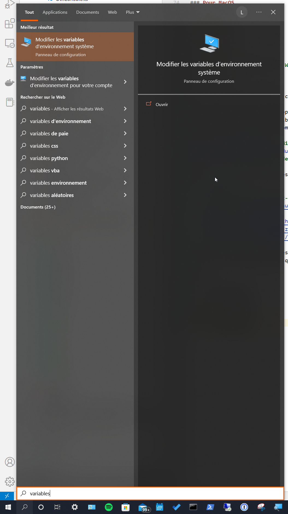
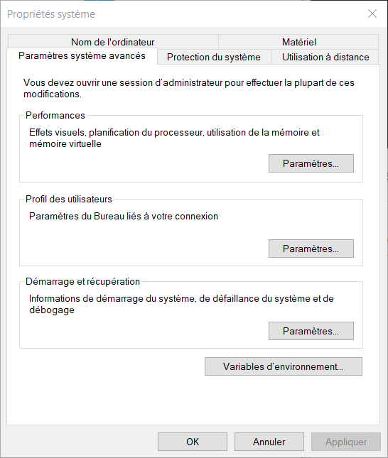
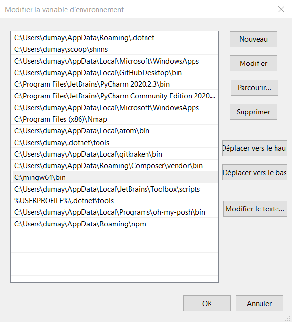

[Retour](../../)

# Installer le compilateur GCC pour compiler du code C sur Linux, Windows et MacOS

## 1 - Qu'est-ce que GCC ?

**GCC** est un compilateur de code de [GNU Compiler Collection](https://fr.wikipedia.org/wiki/GNU_Compiler_Collection) capable de compiler du **C** dans sa version **12.2**.

## 2 - Vérifier l'installation du compilateur GCC

Comme il est probable que vous votre environnement le possède déjà, il est nécessaire de vérifier la présence du compilateur de GCC dans votre environement.

Voici la commande pour effectuer cela :

```
gcc --version && gcc -v
```

### Sur Linux

```

gcc (Ubuntu 11.3.0-1ubuntu1~22.04) 11.3.0
Copyright (C) 2021 Free Software Foundation, Inc.
This is free software; see the source for copying conditions.  There is NO
warranty; not even for MERCHANTABILITY or FITNESS FOR A PARTICULAR PURPOSE.

Using built-in specs.
COLLECT_GCC=gcc
COLLECT_LTO_WRAPPER=/usr/lib/gcc/x86_64-linux-gnu/11/lto-wrapper
OFFLOAD_TARGET_NAMES=nvptx-none:amdgcn-amdhsa
OFFLOAD_TARGET_DEFAULT=1
Target: x86_64-linux-gnu
Configured with: ../src/configure -v --with-pkgversion='Ubuntu 11.3.0-1ubuntu1~22.04' --with-bugurl=file:///usr/share/doc/gcc-11/README.Bugs --enable-languages=c,ada,c++,go,brig,d,fortran,objc,obj-c++,m2 --prefix=/usr --with-gcc-major-version-only --program-suffix=-11 --program-prefix=x86_64-linux-gnu- --enable-shared --enable-linker-build-id --libexecdir=/usr/lib --without-included-gettext --enable-threads=posix --libdir=/usr/lib --enable-nls --enable-bootstrap --enable-clocale=gnu --enable-libstdcxx-debug --enable-libstdcxx-time=yes --with-default-libstdcxx-abi=new --enable-gnu-unique-object --disable-vtable-verify --enable-plugin --enable-default-pie --with-system-zlib --enable-libphobos-checking=release --with-target-system-zlib=auto --enable-objc-gc=auto --enable-multiarch --disable-werror --enable-cet --with-arch-32=i686 --with-abi=m64 --with-multilib-list=m32,m64,mx32 --enable-multilib --with-tune=generic --enable-offload-targets=nvptx-none=/build/gcc-11-xKiWfi/gcc-11-11.3.0/debian/tmp-nvptx/usr,amdgcn-amdhsa=/build/gcc-11-xKiWfi/gcc-11-11.3.0/debian/tmp-gcn/usr --without-cuda-driver --enable-checking=release --build=x86_64-linux-gnu --host=x86_64-linux-gnu --target=x86_64-linux-gnu --with-build-config=bootstrap-lto-lean --enable-link-serialization=2
Thread model: posix
Supported LTO compression algorithms: zlib zstd
gcc version 11.3.0 (Ubuntu 11.3.0-1ubuntu1~22.04) 
```

### Sur MacOS

**[EN COURS]**

### Sur Windows

Ci-dessous, le résultat pour la présence d'une installation de GCC contenu dans le kit de développement [MinGW](https://fr.wikipedia.org/wiki/MinGW), disponible en **32** et **64** bits.

```
gcc.exe (x86_64-win32-seh-rev2, Built by MinGW-W64 project) 12.2.0
Copyright (C) 2022 Free Software Foundation, Inc.
This is free software; see the source for copying conditions.  There is NO
warranty; not even for MERCHANTABILITY or FITNESS FOR A PARTICULAR PURPOSE.

Using built-in specs.
COLLECT_GCC=C:\mingw64\bin\gcc.exe
COLLECT_LTO_WRAPPER=C:/mingw64/bin/../libexec/gcc/x86_64-w64-mingw32/12.2.0/lto-wrapper.exe
Target: x86_64-w64-mingw32
Configured with: ../../../src/gcc-12.2.0/configure --host=x86_64-w64-mingw32 --build=x86_64-w64-mingw32 --target=x86_64-w64-mingw32 --prefix=/mingw64 --with-sysroot=/c/mingw-builds/ucrt64-seh-win32/x86_64-1220-win32-seh-ucrt-rt_v10-rev2/mingw64 --enable-host-shared --disable-multilib --enable-languages=c,c++,fortran,lto --enable-libstdcxx-time=yes --enable-threads=win32 --enable-libgomp --enable-libatomic --enable-lto --enable-graphite --enable-checking=release --enable-fully-dynamic-string --enable-version-specific-runtime-libs --enable-libstdcxx-filesystem-ts=yes --disable-libstdcxx-pch --disable-libstdcxx-debug --enable-bootstrap --disable-rpath --disable-win32-registry --disable-nls --disable-werror --disable-symvers --with-gnu-as --with-gnu-ld --with-arch=nocona --with-tune=core2 --with-libiconv --with-system-zlib --with-gmp=/c/mingw-builds/ucrt64-seh-win32/prerequisites/x86_64-w64-mingw32-static --with-mpfr=/c/mingw-builds/ucrt64-seh-win32/prerequisites/x86_64-w64-mingw32-static --with-mpc=/c/mingw-builds/ucrt64-seh-win32/prerequisites/x86_64-w64-mingw32-static --with-isl=/c/mingw-builds/ucrt64-seh-win32/prerequisites/x86_64-w64-mingw32-static --with-pkgversion='x86_64-win32-seh-rev2, Built by MinGW-W64 project' --with-bugurl=https://sourceforge.net/projects/mingw-w64 CFLAGS='-O2 -pipe -fno-ident -I/c/mingw-builds/ucrt64-seh-win32/x86_64-1220-win32-seh-ucrt-rt_v10-rev2/mingw64/opt/include -I/c/mingw-builds/ucrt64-seh-win32/prerequisites/x86_64-zlib-static/include -I/c/mingw-builds/ucrt64-seh-win32/prerequisites/x86_64-w64-mingw32-static/include' CXXFLAGS='-O2 -pipe -fno-ident -I/c/mingw-builds/ucrt64-seh-win32/x86_64-1220-win32-seh-ucrt-rt_v10-rev2/mingw64/opt/include -I/c/mingw-builds/ucrt64-seh-win32/prerequisites/x86_64-zlib-static/include -I/c/mingw-builds/ucrt64-seh-win32/prerequisites/x86_64-w64-mingw32-static/include' CPPFLAGS=' -I/c/mingw-builds/ucrt64-seh-win32/x86_64-1220-win32-seh-ucrt-rt_v10-rev2/mingw64/opt/include -I/c/mingw-builds/ucrt64-seh-win32/prerequisites/x86_64-zlib-static/include -I/c/mingw-builds/ucrt64-seh-win32/prerequisites/x86_64-w64-mingw32-static/include' LDFLAGS='-pipe -fno-ident -L/c/mingw-builds/ucrt64-seh-win32/x86_64-1220-win32-seh-ucrt-rt_v10-rev2/mingw64/opt/lib -L/c/mingw-builds/ucrt64-seh-win32/prerequisites/x86_64-zlib-static/lib -L/c/mingw-builds/ucrt64-seh-win32/prerequisites/x86_64-w64-mingw32-static/lib ' LD_FOR_TARGET=/c/mingw-builds/ucrt64-seh-win32/x86_64-1220-win32-seh-ucrt-rt_v10-rev2/mingw64/bin/ld.exe --with-boot-ldflags=' -Wl,--disable-dynamicbase -static-libstdc++ -static-libgcc'
Thread model: win32
Supported LTO compression algorithms: zlib
gcc version 12.2.0 (x86_64-win32-seh-rev2, Built by MinGW-W64 project)
```

## 3 - Installer le compilateur GCC

### Pour Linux

Pour linux, l'installation est simple, il suffit d'effectuer la commande ci-dessous.

```
apt install gcc
```

### Pour MacOS

**[EN COURS]**

### Pour Windows

#### En vidéo

[How to Install MinGW W64 for Windows (2022)](https://www.youtube.com/watch?v=dRxPUblx2SY)

#### En texte

Ici, nous allons installer le compilateur GCC contenu dans le kit de développement [MinGW](https://fr.wikipedia.org/wiki/MinGW), disponible en **32** et **64** bits.

Noter que celui-ci est développer pour divers OS.
Afin d'offrir une grande flexibilité, nous allons télécharger et installer le kit Windows de WinLibs.com.
Ce kit permet d'incluer des compilateurs pour **Ada**, **C**, **C++**, **Fortran**, **Obj-C**, **Obj-C++** et **Assembler**.

- Source de documentation : [MinGW-w64](https://www.mingw-w64.org/downloads/#winlibscom)
- Source de développement GitHub : [niXman/mingw-builds-binaries](https://github.com/niXman/mingw-builds-binaries/releases)
- Source de **téléchargement de MinGW-w64 for Windows** : [WinLibs](https://winlibs.com/)

Télécharger le pack de binaires **winlibs-x86_64-posix-seh-gcc-12.2.0-llvm-15.0.7-mingw-w64ucrt-10.0.0-r4.zip** compresser au format **zip** d'extension **.zip**.

- Version 10.0.0
  - [12.2.0-15.0.6-10.0.0-ucrt-r](https://github.com/brechtsanders/winlibs_mingw/releases/tag/12.2.0-15.0.7-10.0.0-ucrt-r4)
    - [direct 7z](https://github.com/brechtsanders/winlibs_mingw/releases/download/12.2.0-15.0.7-10.0.0-ucrt-r4/winlibs-x86_64-posix-seh-gcc-12.2.0-llvm-15.0.7-mingw-w64ucrt-10.0.0-r4.7z)
    - [direct zip](https://github.com/brechtsanders/winlibs_mingw/releases/download/12.2.0-15.0.7-10.0.0-ucrt-r4/winlibs-x86_64-posix-seh-gcc-12.2.0-llvm-15.0.7-mingw-w64ucrt-10.0.0-r4.zip)
- [Toutes les versions](https://github.com/brechtsanders/winlibs_mingw/releases/)

Une fois télécharger, décompresser le pack de binaires **winlibs-x86_64-posix-seh-gcc-12.2.0-llvm-15.0.7-mingw-w64ucrt-10.0.0-r4.zip**, puis déplacer le dossier contenu **mingw64** à la racine du disque de Windows.

Ensuite, ouvrir **Modifier les variables**.



Sélectionner **Variables d'environement**.



Sélectionner la variable **Path**, puis cliquer sur **Modifier**.


Ajouter ou modifier la variable d'environement `C:\mingw64\bin`.

