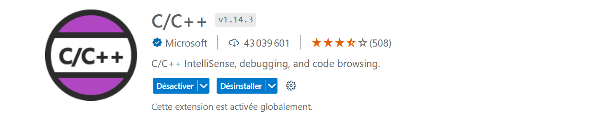
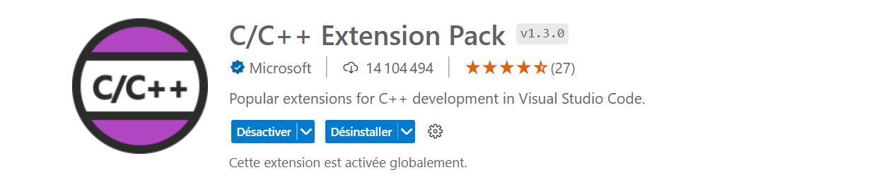
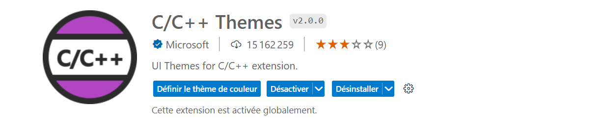
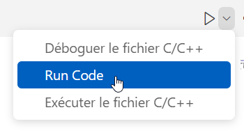
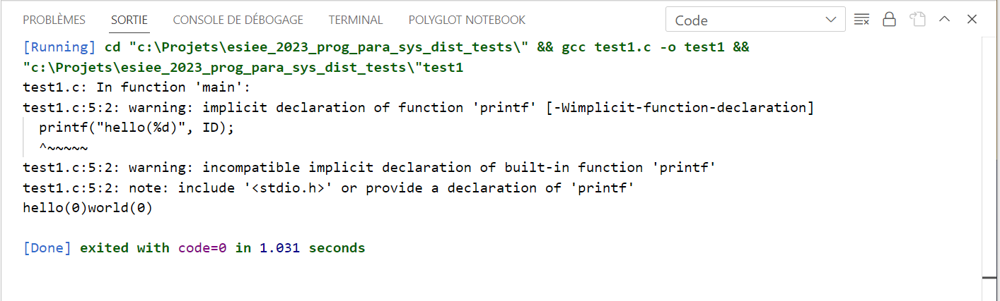

[Retour](../../)

# Développement en C/C++ avec Visual Studio Code

> **ATTENTION** : 
> 
> Il est nécessaire d'avoir compilateur C/C++ d'installer. 
> 
> Un guide est disponible [ici](../../Dev_C_And_C++_Install_GCC.md).

## Etape 1

Il est nécéssaire d'**installer les extensions** ci-dessous.

*=> L'extension C/C++*

*=> L'extension C/C++ Extension Pack*

*=> L'extension C/C++ Themes*

*=> L'extension Code Runner*

## Etape 2

**Un bouton d'exécution** doit apparaître sur chaque page contenant du code **C** ou **C++**.

Il suffit ensuite de cliquer sur **Run Code**.

Voici un exemple de résultat obtenable ci-dessous.

Voilà, tout est prêt pour exécuter du code C/C++ sur Visual Studio Code.